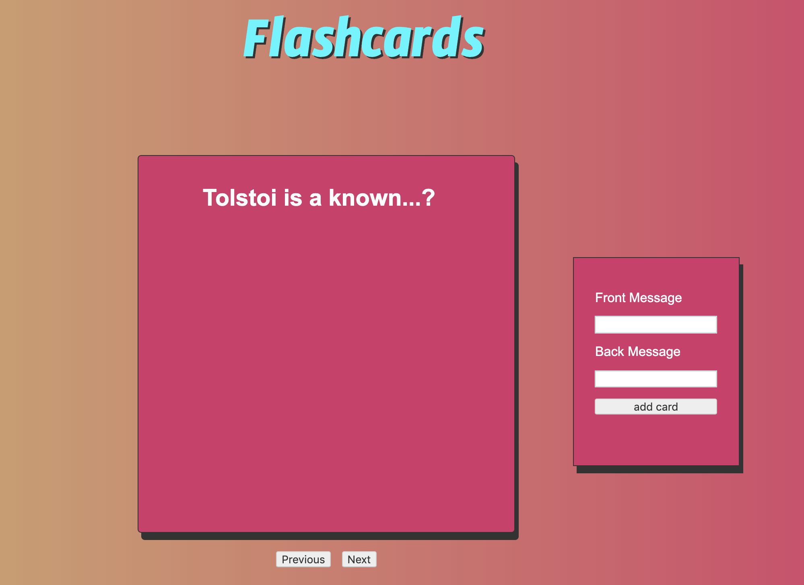

# Flash Cards App using UMV architecture

I'm writing this app as an exercise for better Software Design.

You have to click the current card to see the content at the other side. Buttons previous and next will show you the other available cards in the stack. At the right there is a form that will let you to add more cards to the current stack. For the moment, the cards just last until a browser refresh.

